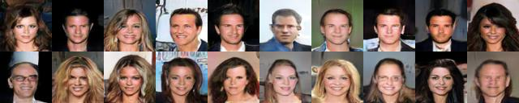
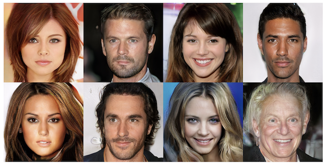

# StyleGAN

#### Generative Adverserial Networks are a relatively young branch of Machine Learning, using Neural Networks to generate new Datapoints from a certain distribution. The technology was first introduced to the public by Ian Goodfellow in 2014 (https://arxiv.org/abs/1406.2661). And has seen a steady increase in effectiveness over the last years, especially in the area of image generation, with papers such as [StyleGAN](https://arxiv.org/abs/1812.04948) and [ProGAN](https://arxiv.org/abs/1710.10196) by Nvidia Researchers that this implementation is based on.
#
## The overlying principle of Generative Adverserial Networks, as proposed by Goodfellow in 2014, works like this:
To start out we define 2 Neural Networks (Often Convolutional Neural Networks): 

1. The first network is trained to classify if a given datapoint (e.g. image) is from a dataset of real data
or a generated one (this network is commonly called Discriminator or Critic), it gets fed an image as input and spits out a number, indicating whether the network thinks the datapoint is real or not.

2. The second network (commonly called Generator) gets fed random multidimensional noise, often with values of the uniform or gaussian distribution, and upscales this noise to output an image. It gets trained to fool the Discriminator network to classify it's images as real.

Due to the competition between the two networks, they are forced to improve, ideally leading to a Generator network that produces Images that are indestinguishable from real images.
Oftentimes these networks are inverse versions of each other, comparable to Encoders and Decoders.
#
## Progressive Growing of GANs for improved training Stability as proposed in the [ProGAN paper](https://arxiv.org/abs/1710.10196) by Nvidia Researchers in 2017
### Progressive Growing
Generative Adverserial have alot of properties that make them, due to their nature of being very unstable, very difficult train. One of these dangers is the Discriminator becoming too accurate, which causes the Generator to be unable to learn anything since it doesn't get valuable feedback from the Discriminator.
One method to combat this, was proposed in 2017 by Nvidia researchers and published in their paper about Progressively Growing Networks that start out generating images at a low resolution (4x4 pixels) and then progressively double the resolution by using upscaling + additional layers. 

This makes it possible to generate higher resolution images since the task of the training the networks is divided into smaller steps and a large amount of the training takes place at lower resolutions.

Here are some images generated by the authors of the ProGAN paper. Their model was trained for 4 days on 8 Nvidia Tesla V100 GPUs and outputs images with a resolution of 1024x1024.

&nbsp;
## Mode Collapse
Another problem in training of Generative Adverserial Networks is called "Mode Collapse", this happens when the Generator has a miniscule variation in the images it generates, meaning it only generates very similar images or even only a single one, independent of the input noise.
This is not desirable when training GAN's since we want to train a network that can generate as many different images as possible, depending on the noise we give it.

### Minibatch Standard Deviation for combatting Mode Collapse
The authors of the ProGAN paper propose a new solution to combatting Mode Collapse called "Minibatch Standard Deviation", it concatenates a new filter to the last layer of the Discriminator, containing information about the difference between the images in the current minibatch. If the Generator starts to collapse and the generated images have a small variation, the Discriminator has an easy way of identifying fake images, hence forcing the Generator to create images with a larger variation.
#
## WGAN-GP loss function for increased training stability as proposed in [Improved Training of Wasserstein GANs paper](https://arxiv.org/abs/1704.00028)
Another method to combat training instability in GAN's is a new loss metric for training the Discriminator from the "Improved Training of Wasserstein GANs" paper (by Ishaan Gulrajani, Faruk Ahmed, Martin Arjovsky, Vincent Dumoulin, Aaron Courville). They use the WGAN loss which utilizes the Wasserstein (D(r) - D(f)) distance of the Discriminator output. The Discriminator wants to increase the buffer between the prediction on real images and the prediction on generated images.
The paper introduces a gradient penalty to the loss function of the Discriminator to prevent the Discriminator from overshooting on his predictions, thus preventing exploding gradients.
#
My model was trained for 20 Hours on a Nvidia GTX 1080, starting at a resolution of 8x8 pixels and reaching a maximum resolution of 64x64 pixels per image.
Here is a GIF showing the training progress:

&nbsp;

and here are some of images that the network generated:

